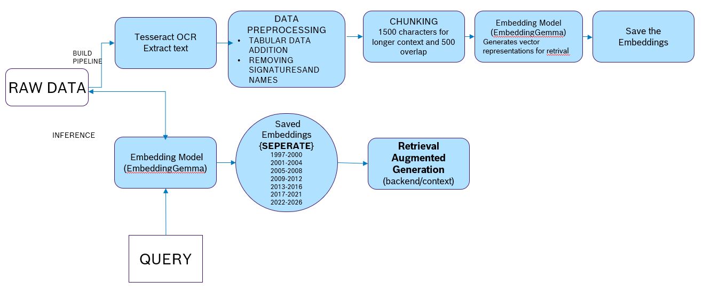

# 🌟 LTS CHATBOT

An intelligent, context-aware question-answering system designed for Human Resource Documents.

## Project Overview

This project is a smart assistant built on the **Retrieval Augmented Generation (RAG)** pattern. Its primary function is to provide instant, accurate, and citable answers to questions based on an organization's HR documents, helping them in thier endevours.


## 1. Technical Architecture & Core Components

The solution is architected to be robust, secure, and highly capable, leveraging Azure's enterprise-grade AI services.

### Core Technology Stack (RAG Pipeline)

| Component | Technology/Function | Description |
| :--- | :--- | :--- |
| **LLM / Generative Model** | **Azure OpenAI Service** | Utilizes **gpt-4o** for robust natural language understanding and synthesis of final, human-readable answers. |
| **Retrieval System** | **Gemma Embeddings & Vector Store** | Uses **Chroma** to create vector embeddings of HR documents, enabling highly relevant semantic search. |
| **Document Ingestion** | **Tesseract OCR Integration** | Handles new document uploads (primarily PDFs). The integrated **OCR functionality** ensures even scanned or image-based documents are fully processed for text extraction before chunking and embedding. |
| **Data Visualization** | **Interactive Visualizations** | Generates real-time, interactive charts/graphs based on **generated answers** using OpenAI. |
| **Deployment Strategy** | **On-Premise Executable** | The entire application and its dependencies are converted into a standalone **.exe** file for secure, air-gapped deployment on an internal server to meet data governance and security requirements. |

---

## 2. High-Level System Flow

The system operates via a two-stage process: Document Ingestion and Query/Answer Generation.

### Document Ingestion Pipeline

1.  **Upload:** A new HR document is uploaded (e.g., a policy PDF).
2.  **OCR:** If the document is scanned or image-based, **Optical Character Recognition (OCR)** extracts the underlying text.
3.  **Chunking:** The extracted text is broken down into semantically meaningful **Chunks**.
4.  **Embedding:** These chunks are converted into **Vector Embeddings** using the configured embedding model.
5.  **Storage:** Embeddings are stored in the **Vector Store** for fast retrieval.

### Query and Answer Generation

1.  **Query:** A user submits a question (e.g., "What is the HRA Allowance of 2022?").
2.  **Retrieval (RAG):** The user's question is embedded, and a search is performed against the Vector Store to retrieve the **most relevant document chunks (context)**.
3.  **Generation:** The original question **PLUS** the retrieved context are packaged and sent as a prompt to **Azure OpenAI**.
4.  **Answer:** Azure OpenAI synthesizes a final, accurate answer, often with citations to the source document, and delivers it to the user.
4.  **Visualization:** Using Azure OpenAI synthesized final answer,an interactive chart is delivered to the user.

---

## 3. Setup & RUN
Create a virtual Environment
```python
conda create -p venv python == 3.10.6 -y
```
Activate the virtual environment 
```python
conda activate /path
```
Install required dependencies 
```python
pip install -r requirements.txt
```
**To run the app on local system**
```python
## Make sure the file is in root directory and not in ui folder only while running
streamlit run app.py
```
**To build the .exe**
 ```python
pyinstaller run_app.spec
```
## 4. Dependencies Required

This project relies on the following external components and versions. Please ensure they are installed and correctly configured on your system, especially when running the application on an on-premise server.

| Component | Version | Description |
| :--- | :--- | :--- |
| **Embedding Model** | `embeddinggemma-300m` | The specific model used for generating vector embeddings from text data (e.g., for RAG or search features). |
| **Poppler** | `25.07.0` | Essential command-line utilities for processing and rendering PDF files. Required for PDF content extraction. |
| **Tesseract-OCR** | `5.5.0.20241111` | The Optical Character Recognition engine used to extract text from images or scanned documents within the application. |
## 5. Flow Diagrams 
### The following flowchart describes the workflow of the entire project 


### The following flowchart describes the workflow of Retrieval Augmented Generation used in the project 
